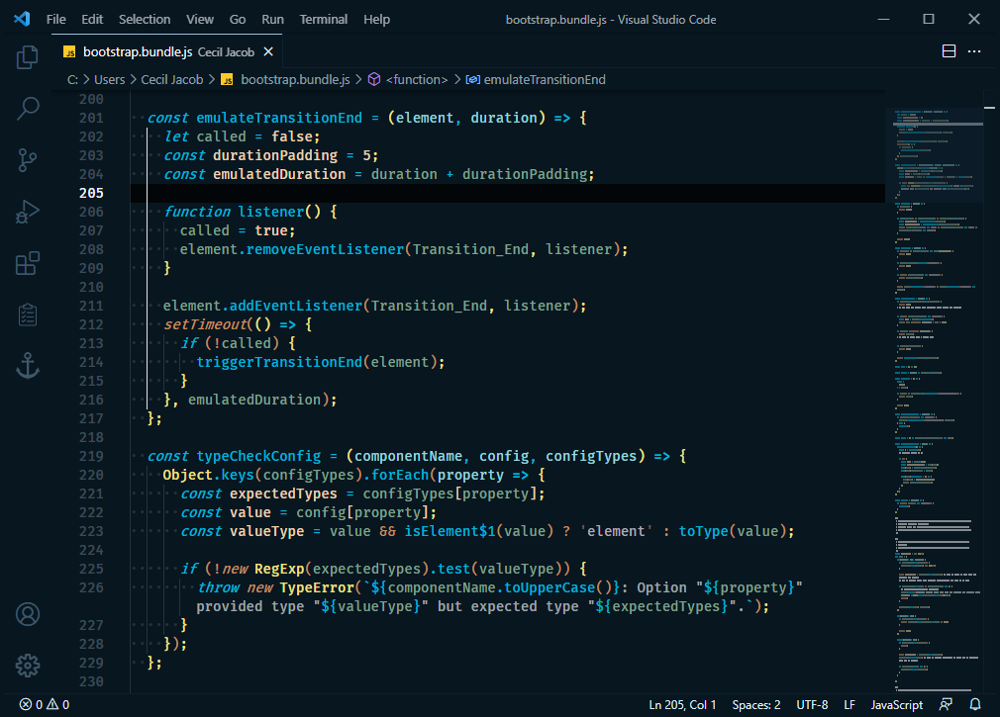
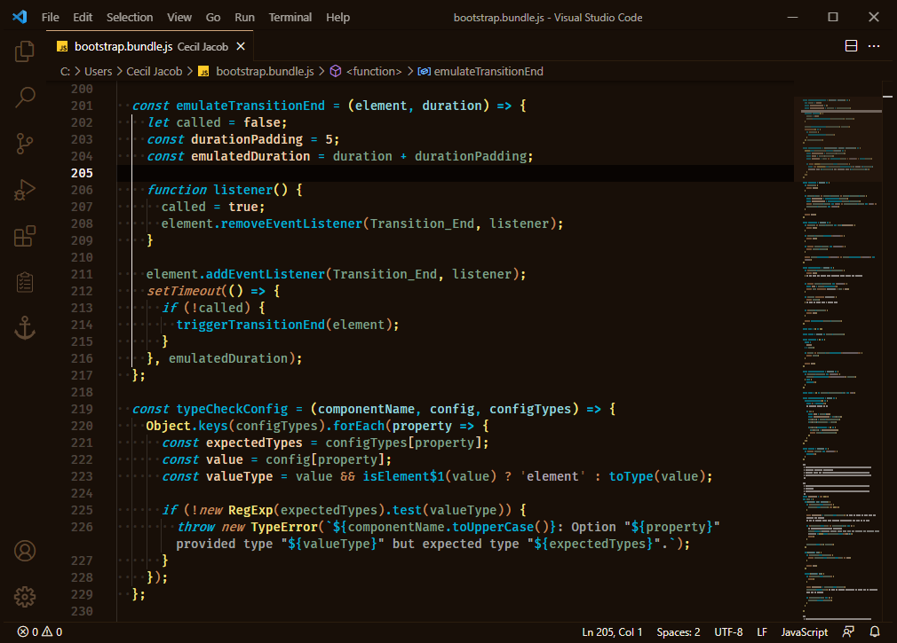

# Theme +

This is a code editor theme with extensive syntax highlight and workbench color customization implemented.

<br>
<br>

## Theme Screenshot

### Theme + Dark Blue Theme



<br>
<br>

### Theme + Dark Brown Theme



<br>
<br>

## Installation

1 - Open the __Extensions__ sidebar panel from within the Visual Studio Code editor window.<br>
`Menu Path : View > Extensions`<br>
`Keyboard Shortcut : Ctrl + Shift + X`

2 - Search for the theme in the extension marketplace search and then click the __Install__ button.<br>
__`Search Term : code-plus-theme`__

3 - Enable the installed theme from the Color Theme drop down list.<br>
`Menu Path : Code / File > Preferences > Color Theme > Theme +`<br>
`Keyboard Shortcut : Ctrl + K Ctrl + T`

<br>
<hr>
<br>

## Share Extension

Please share this theme extension with others that might find it useful.<br>

__Share To :__ &nbsp;&nbsp; [LinkedIn](https://www.linkedin.com/shareArticle?mini=true&url=https://marketplace.visualstudio.com/items?itemname=ceciljacob.code-plus-theme) &nbsp;&nbsp;|&nbsp;&nbsp; [Twitter](https://twitter.com/intent/tweet?url=https://marketplace.visualstudio.com/items?itemname=ceciljacob.code-plus-theme) &nbsp;&nbsp;|&nbsp;&nbsp; [Facebook](https://www.facebook.com/sharer/sharer.php?u=https://marketplace.visualstudio.com/items?itemname=ceciljacob.code-plus-theme)

<br>
<br>

## Feedback

Please report issues related to this theme on the repository page.<br>

[GitHub Repository](https://github.com/ceciljacob/code-plus-theme/issues)

<br>
<br>

## Developer Information

Please visit the developer web site for additional information.<br>

[www.ceciljacob.com](https://www.ceciljacob.com)

<br>

__Follow On :__ &nbsp;&nbsp; [LinkedIn](https://www.linkedin.com/in/ceciljacob) &nbsp;&nbsp;|&nbsp;&nbsp; [Twitter](https://www.twitter.com/ceciljacob)

<br>
<hr>
<br>

## License

__Creative Commons Attribution 4.0 International License__

<br>

This work is licensed under the terms of the license available below.<br>

__License :__ [Creative Commons Attribution 4.0 International License](https://creativecommons.org/licenses/by/4.0/legalcode)

<br>
<hr>
<br>

## Recommended Custom Setting

The recommended setting for other popular extensions when used with this theme is below.<br>

### Add Within Settings File - ( `settings.json` )

<br>

Custom Setting - [Indent Rainbow](https://marketplace.visualstudio.com/items?itemName=oderwat.indentrainbow)

``` JSON
"indentRainbow.colors": [
  "rgba(194,142,96,0.05)",
  "rgba(0,180,214,0.05)",
  "rgba(244,226,134,0.05)",
  "rgba(93,138,116,0.05)"
],
"indentRainbow.errorColor": "rgba(223,91,2,0.15)",

```

<br>

Custom Setting - [Bracket Pair Colorizer 2](https://marketplace.visualstudio.com/items?itemName=coenraads.bracket-pair-colorizer-2)

``` JSON
"bracket-pair-colorizer-2.colorMode": "Consecutive",
"bracket-pair-colorizer-2.colors": [
  "#c28e60",
  "#00b4d6",
  "#f4e286"
],
"bracket-pair-colorizer-2.unmatchedScopeColor": "#ba4d06",

```

<br>

Custom Setting - [Bracket Pair Colorizer](https://marketplace.visualstudio.com/items?itemName=coenraads.bracket-pair-colorizer)

``` JSON
"bracketPairColorizer.consecutivePairColors": [
    ["{", "}"],
    ["<", ">"],
    ["(", ")"],
    ["[", "]"],
    [
      "#c28e60",
      "#00b4d6",
      "#f4e286"
    ],
    "#ba4d06"
],

```

<br>
<hr>
<br>

Copyright &copy; Cecil Jacob

<br>
<br>
